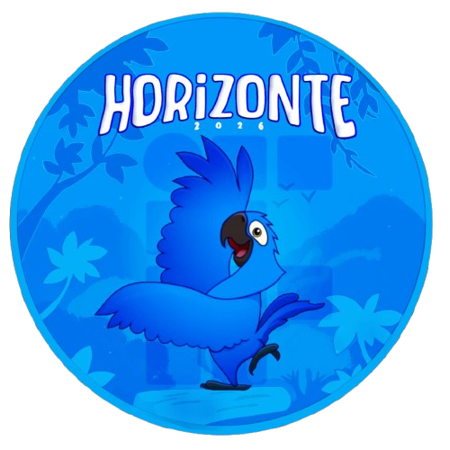

# Horizonte 2026



Bem-vindo ao **Horizonte**, um projeto inovador desenvolvido para a **Chapa do Grêmio**! Este site foi criado em 2026 para inspirar e conectar comunidades, oferecendo uma experiência visual imersiva e interativa.

## ✨ Descrição

Horizonte é uma aplicação web moderna que combina tecnologias de ponta para criar interfaces dinâmicas e envolventes. Desenvolvido com foco na criatividade e na performance, ele serve como uma plataforma para a Chapa do Grêmio, promovendo ideias, eventos e conexões.

## 🚀 Tecnologias Utilizadas

Este projeto foi construído utilizando as seguintes dependências:

- **React** - Biblioteca para construção de interfaces de usuário.
- **Tailwind CSS** - Framework CSS utilitário para estilização rápida e responsiva.
- **DaisyUI** - Componentes UI baseados em Tailwind para designs elegantes.
- **OGL** - Biblioteca para gráficos 3D e WebGL, adicionando elementos visuais avançados.
- **Framer Motion** - Biblioteca para animações fluidas e interativas.
- **Heroicons** - Conjunto de ícones SVG otimizados para interfaces modernas.

## 📦 Instalação

1. Clone o repositório:
   ```bash
   https://github.com/JaoPred0/Horizonte
   ```
2. Navegue até o diretório do projeto:
   ```bash
   cd horizonte
   ```
3. Instale as dependências:
   ```bash
   npm install
   ```
4. Inicie o servidor de desenvolvimento:
   ```bash
   npm start
   ```
5. Abra [http://localhost:3000](http://localhost:3000) no seu navegador.

- **Elementos 3D**: Uso de OGL para gráficos interativos.
- **Componentes UI**: Componentes pré-estilizados com DaisyUI e Tailwind.
- **Ícones Modernos**: Ícones vetoriais de Heroicons para uma aparência profissional.

## 👨‍💻 Programador

Desenvolvido por **Programadoor**  
[](https://github.com/JaoPred0)

## 🔗 Links

- [Site ao Vivo](https://horizonte.vercel.app) 
- [Repositório GitHub](https://github.com/JaoPred0/horizonte)

---
Feito com ❤️ para a Chama do Grêmio em 2026. Explore o horizonte das possibilidades! 🌟
 <!-- Substitua por uma imagem de footer se disponível -->